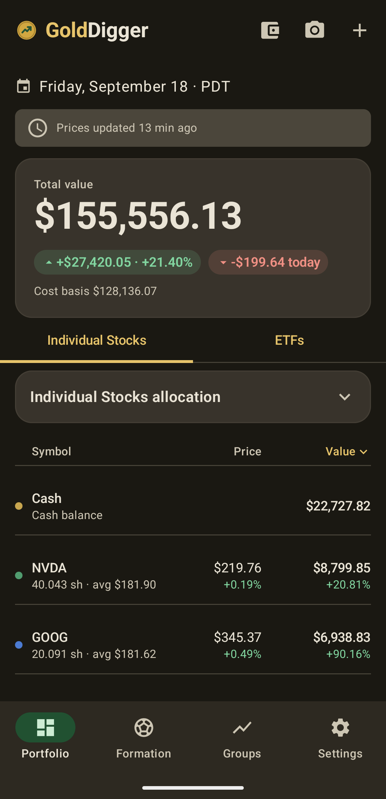
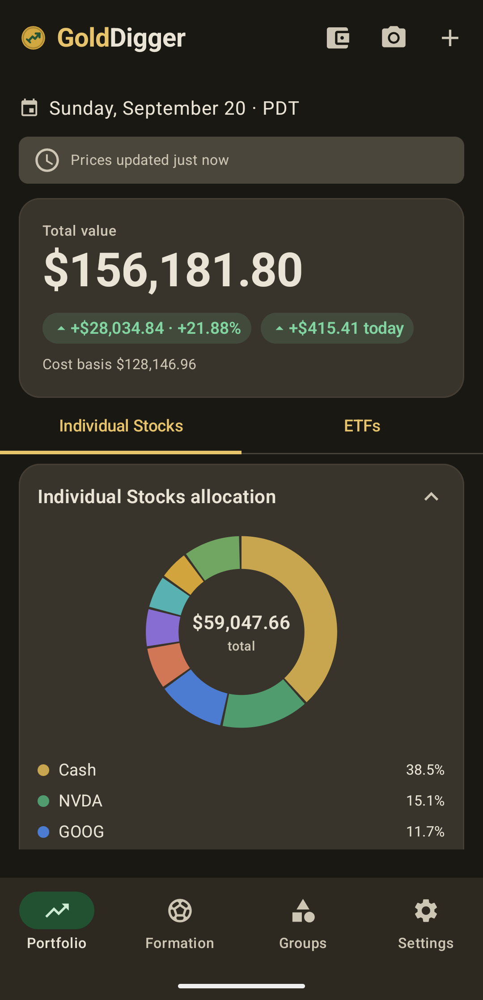
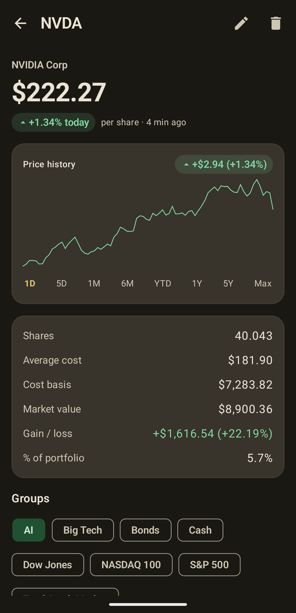
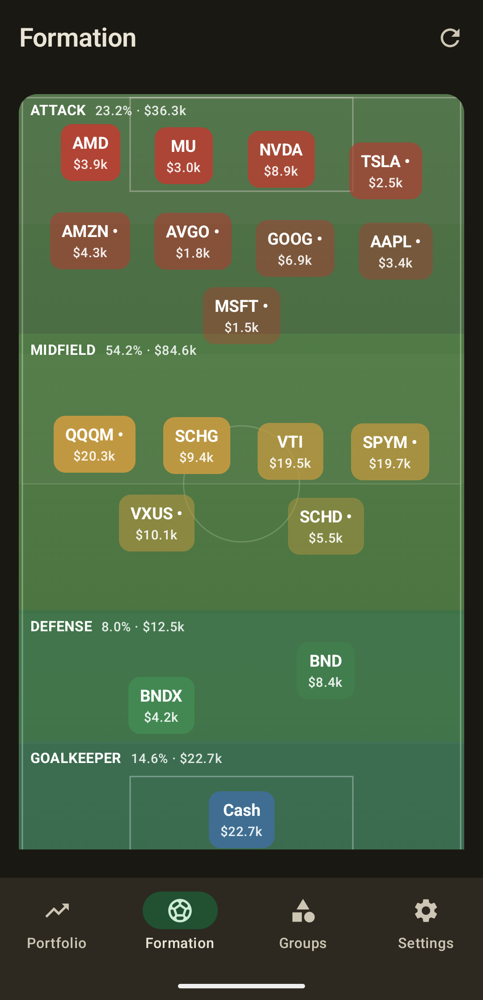
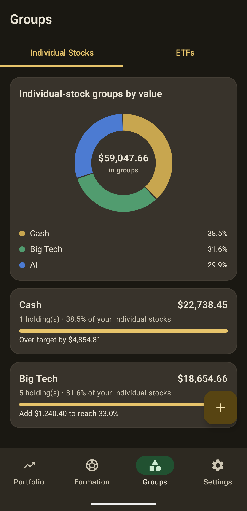

# GoldDigger

A native Android app for tracking an arbitrary, unbounded number of stock
holdings. Nothing about the schema, seed data, or business logic hardcodes a
ticker — the database starts empty and everything (charts, groups, totals) is
derived at runtime from whatever you add.

Four bottom-nav tabs — **Portfolio**, **Formation**, **Groups**, **Settings** —
swipeable as well as tappable (dark theme, Pixel 7 Pro):

| Portfolio                                                                            | Allocation                                                           | Holding detail                                                                | Formation                                                                      | Groups                                                            |
| ------------------------------------------------------------------------------------ | -------------------------------------------------------------------- | ----------------------------------------------------------------------------- | ------------------------------------------------------------------------------ | ----------------------------------------------------------------- |
|                                |                  |                         |                               |                         |
| Total value, gain/loss and a sortable holdings list, tabbed Individual Stocks / ETFs | Collapsible donut chart — drag a finger across it to inspect a slice | Price history with 1D–Max ranges and scrubbing, group membership, recent news | Holdings on a soccer pitch by risk role: attack, midfield, defense, goalkeeper | Buckets with target allocations and an "add $X to reach 40%" hint |

## Requirements

* A recent Android Studio (one that supports AGP 8.13)
* JDK 17–21 — set it as Android Studio's Gradle JVM (*Settings → Build Tools →
  Gradle → Gradle JVM*), or via `JAVA_HOME` for the command line. Gradle 8.13
  doesn't support the JDK 25 that recent Android Studio bundles. To pin one, put
  `org.gradle.java.home=<path>` in your user-level `~/.gradle/gradle.properties`
  — not in the project's `gradle.properties`, since that path is
  machine-specific
* Android SDK with API 35 installed
* Runs on **Android 8.0 (API 26)** and up; compiled and targeted against **API 35**
* A free [Finnhub](https://finnhub.io/register) API key for live quotes, news and
  ticker search (optional — the app builds and runs without one)

## Setup

1. Clone the repo and open it in Android Studio (or build from the command line).
2. Create `local.properties` in the project root (Android Studio makes one
   automatically; otherwise copy `local.properties.example`):

   ```properties
   sdk.dir=/path/to/Android/Sdk
   FINNHUB_API_KEY=your_key_here
   ```

3. Build & run:

   ```bash
   ./gradlew :app:assembleDebug        # build the APK
   ./gradlew :app:assembleRelease      # R8-shrunk release APK (debug-signed, see below)
   ./gradlew :app:installDebug         # install on a running device/emulator
   ./gradlew :app:testDebugUnitTest    # JVM unit tests
   ./gradlew :app:connectedDebugAndroidTest   # instrumentation tests (needs a device)
   ./gradlew :app:lintDebug            # Android lint
   ```

### Where the API key goes

Live quotes, company profiles, ticker search and news all come from
**Finnhub**. The key is **never committed**:

* Put `FINNHUB_API_KEY` in `local.properties` (git-ignored).
* `app/build.gradle.kts` reads it at configure time and exposes it as
  `BuildConfig.FINNHUB_API_KEY` (it also falls back to a `FINNHUB_API_KEY`
  environment variable, which is handy for CI).
* If the key is missing the app still builds and every other feature works;
  prices just show a *"No price API key configured"* status instead of live
  quotes.
* The key is appended to each request by an OkHttp interceptor that runs
  *after* the debug logging interceptor, so it never appears in Logcat.

Get a free key at <https://finnhub.io/register>.

### First run

1. First launch shows the empty-state prompt → **Add a holding** (or tap the
   wallet icon to add cash, or the camera icon / *"Or import from a photo"*
   to bring in a whole positions list at once).
2. Type a ticker (e.g. `NVDA`); search-as-you-type hits Finnhub `/search`
   (debounced 300 ms). Pick a result, enter shares and cost.
3. Save → a one-shot `PriceSyncWorker` fetches the quote; the dashboard shows the
   position with a live price, a pie chart slice, and portfolio totals.
4. Tap a **column header** to sort the list, or open the holding to see its
   detail, price-history chart and news.
5. Open the holding → **Groups** → create/assign a group like `AI/Semis` with a
   target %.
6. The Groups tab now shows that bucket's actual vs. target allocation and
   *"Add $X (5.2%) to reach 40%"*.
7. Open the **Formation** tab: the holding is placed on the pitch by its beta
   (Attack / Midfield / Defense) or as the Goalkeeper if it's cash. Long-press a
   player chip to pin its role by hand.

## Features

* **Holdings** — add / edit / delete by ticker with search-as-you-type lookup
  (debounced 300 ms). Live quotes via Finnhub, cached in Room. Adding a ticker
  you already hold merges into that position (shares and cost basis both sum,
  so average cost updates itself) rather than creating a second row for the
  same stock — the app flags it before you save so it's never a surprise.
* **Cash** — a synthetic `$CASH` position (price pinned to 1.0, never quoted)
  that flows through every calculation, the pie chart and the group buckets with
  no special cases in the math.
* **Dashboard** — total value, all-time and day gain/loss, a today-dated header
  in the device's current time zone, an interactive donut chart (drag a finger
  across it to inspect a slice), and a holdings list.
* **Individual Stocks / ETFs tabs** — the Dashboard's allocation chart and
  holdings list are tabbed between **Individual Stocks** and **ETFs**, one
  group shown at a time; swipe left/right on the chart/list area to switch,
  same as tapping a tab (a `HorizontalPager` backs the two tabs, so each page
  scrolls independently while the total-value card above stays put). A stock's
  `isEtf` classification is guessed from the price provider's search result
  when you add or import it (correctable by hand on the Add/Edit and
  photo-import-review screens). Because each tab's chart is built only from
  that group's own holdings, its slice percentages sum to 100% on their own —
  "what fraction of my ETFs is this one," not "of my whole portfolio." Cash
  stays under Individual Stocks, matching how it already behaves everywhere
  else in the app. The chart card is **collapsed by default** — tap its header
  (a chevron shows the state) to expand it — so the holdings list sits right
  under the hero card instead of below a full donut chart and up-to-8-row
  legend; each tab remembers its own collapsed/expanded state independently.
* **Sortable holdings list** — tap the **Symbol / Price / Value** column headers
  to reorder ascending/descending; unpriced rows always sink to the bottom. Each
  row shows the latest per-share price, today's move, market value, gain %, and a
  color dot matching its pie slice.
* **Per-holding detail** — big price, today's move, average cost, gain/loss,
  % of portfolio, a [price-history chart with a range selector](#price-history-range-selector),
  group membership, and a [recent-news feed](#holding-news-feed).
* **Groups** — user-defined buckets with an optional target allocation and an
  *"add $X to reach 40%"* indicator; a stock can be in several groups. Each
  group is typed as tracking **Individual Stocks** or **ETFs**, and the Groups
  tab is split the same way as the Dashboard — swipeable, one `HorizontalPager`
  page per type — with a group's current/target % measured as a share of that
  type's own total, not the whole portfolio, so a stocks-type group and an
  ETF-type group each have an independent 100%. The membership picker — on a
  group's own detail screen *and* on a holding's detail screen — only offers
  matches for the other side's type, so an ETF can't end up inflating a
  stocks-type group's percentage (or vice versa) from either direction. A
  membership that predates this rule still shows up so there's a way to undo
  it, even if its type no longer matches. Within each tab, groups are ordered
  by current value, largest first; each card shows the actual tickers (not
  just a count) and, once a target's set, "Add $X (Z%) to reach Y%" / "Over
  target (Y%) by $X (Z%)" / "On target (Y%)" — the same wording a group's own
  detail screen shows for itself.
  Each tab also opens with a donut
  chart of that type's groups by dollar value (one slice per group, center
  shows the total currently in groups), same chart component as the Dashboard's
  allocation chart, sitting above the list of group cards.
* **Import from a photo** — snap or pick a screenshot of a positions list and
  GoldDigger reads the ticker, shares and average cost off it on-device, then
  lets you check and fix every row before anything is added. See
  [Import a portfolio from a photo](#import-a-portfolio-from-a-photo).
* **Formation** — your holdings arranged on a soccer pitch by *risk role*
  (goalkeeper = cash, defense = low beta, midfield = market-like, attack = high
  beta / sector-correlated / volatile). Zone height tracks the dollars in the
  zone; automated callouts warn about a thin defense, an over-large cash keeper,
  or a front-loaded lineup, plus an informational note (not a warning) when the
  book is mostly market-like with no real tilt either way. Roles are computed
  from live metrics and can be manually overridden per holding. See
  [Soccer Formation view](#soccer-formation-view).
* **Swipeable tabs** — the four top-level screens (Portfolio, Formation,
  Groups, Settings) live in a `HorizontalPager` behind the bottom nav, so a
  left/right swipe anywhere on a screen switches tabs the same as tapping an
  icon; both stay in sync through one shared `PagerState`.
* **Sync** — pull-to-refresh plus a periodic `WorkManager` job (interval
  configurable, market-hours-only optional), all through one rate limiter.
  Outside market hours a price is only recorded to the chart history when it
  actually moved, so evenings and weekends don't add a flat line.
* **Offline** — the UI only ever reads Room, so cached prices and news stay
  visible with a staleness indicator when the network is down.
* **Backup & restore** — Settings → *Your data* exports holdings, groups and
  price history to a JSON file through the system file picker, imports from one
  after a confirmation, and can delete everything (you have to type `DELETE` to
  confirm). See [Backup & restore](#backup--restore).

## Architecture

MVVM + a repository layer, Hilt for DI, coroutines/`StateFlow` throughout,
single-Activity Compose with Compose Navigation and a bottom navigation bar.
Room is the single source of truth — the UI only ever observes Room.

```
core/        constants (SyncConfig, FormationConfig), MarketHours (open/closed,
             latest session open), CashHolding
data/
  backup/    Backup (JSON format + validation), BackupManager (export / atomic import)
  local/     Room entities, DAOs, relations, migrations
  remote/    StockPriceApi abstraction, Finnhub impl, RequestThrottler
  repository/ PortfolioRepository (single source of truth), SyncState
  settings/  DataStore-backed SyncSettings
  ocr/       PortfolioPhotoDecoder, TextRecognizerService (ML Kit wrapper)
domain/      PortfolioCalculator, FormationClassifier, RiskMath,
             PortfolioOcrParser + pure models
di/          Hilt modules
work/        PriceSyncWorker + PriceSyncScheduler
ui/
  theme/     brand palette, typography
  components/ SectionCard, DeltaChip, ColorDot, charts, wordmark
  dashboard/ formation/ groups/ holding/ importphoto/ settings/   screens + ViewModels
  navigation/  NavHost + routes; GoldDiggerApp hosts the 4 top-level tabs in a
               HorizontalPager behind the bottom nav (swipeable)
```

### Stack

| Concern         | Choice                                                                                                 |
| --------------- | ------------------------------------------------------------------------------------------------------ |
| Language        | Kotlin                                                                                                 |
| UI              | Jetpack Compose + Material 3, branded gold/green palette (light + dark), themed adaptive launcher icon |
| Architecture    | MVVM + Repository, unidirectional `StateFlow`                                                          |
| DI              | Hilt                                                                                                   |
| Persistence     | Room (single source of truth — the UI only ever observes Room)                                         |
| Networking      | Retrofit + OkHttp + kotlinx.serialization                                                              |
| Background work | WorkManager (periodic, constraint-aware)                                                               |
| Charts          | Compose `Canvas` (interactive pie, scrubbable price-history chart, formation pitch) — no chart library |
| Images          | Coil (news thumbnails only)                                                                            |
| OCR             | ML Kit Text Recognition (bundled, on-device — no network call, no API key)                             |
| Tests           | JUnit, Turbine, MockK, Truth, Room `MigrationTestHelper`, Compose UI tests                             |

`applicationId` / `namespace` = `com.golddigger.app` (debug build is
`.debug`). `minSdk 26`, `compileSdk` / `targetSdk 35`.

### Toolchain

|                       | Version                                                                                                                                |
| --------------------- | -------------------------------------------------------------------------------------------------------------------------------------- |
| Android Gradle Plugin | 8.13.2                                                                                                                                 |
| Gradle wrapper        | 8.13                                                                                                                                   |
| Kotlin / KSP          | 2.0.21 / 2.0.21-1.0.28                                                                                                                 |
| JDK                   | 17–21 (Gradle 8.13 doesn't support the JDK 25 that recent Android Studio bundles, so point Gradle at a JDK 17–21 — see *Requirements*) |

Every library version is pinned in `gradle/libs.versions.toml`.

Staying on AGP 8.13.2 is deliberate — AGP 9's built-in-Kotlin feature is not yet
compatible with KSP, so the "AGP can be upgraded" banner in Studio should be
dismissed.

### Rate limiting & batching (built in from day one)

Everything the throttling story needs is in
[`SyncConfig`](app/src/main/java/com/golddigger/app/core/SyncConfig.kt) — no magic
numbers elsewhere:

* **Shared throttler.**
  [`RequestThrottler`](app/src/main/java/com/golddigger/app/data/remote/throttle/RequestThrottler.kt)
  is a sliding-window limiter (`MAX_REQUESTS_PER_MINUTE = 50`) that *every* code
  path goes through — pull-to-refresh, background sync, and ticker search — so the
  app can never exceed the provider's free-tier cap even with 100+ holdings.
* **Batching.** The repository chunks held tickers into
  `min(settings.batchSize, api.maxSymbolsPerQuoteRequest)` per call. Finnhub's
  free `/quote` endpoint is single-symbol, so this is 1 and calls are throttled +
  sequential. A provider with a multi-symbol endpoint reports a higher
  `maxSymbolsPerQuoteRequest` and the same code packs more per call.
* **Cache-first.** A price fetched within the active refresh interval is not
  re-fetched, even if several screens ask at once (`SyncConfig.isFresh` + a
  `Mutex` in the repository that makes overlapping refreshes wait their turn
  and then find everything already fresh).
* **Rate-limit UX.** A 429 becomes a calm status line —
  *"Prices from 9:41 AM. Refresh limit reached — next update in ~3 min"* — via
  [`SyncState`](app/src/main/java/com/golddigger/app/data/repository/SyncState.kt)
  and `SyncStatusBar`, never an error dialog or silent failure.
* **Tunable.** Refresh interval and batch size are user settings (persisted in
  DataStore) so switching to a paid tier needs no code change.

### Offline behavior

Network results always land in Room first; the UI only observes Room. If a sync
fails the last `PriceCache` row is still shown, with a relative-time "stale"
indicator. `PriceCache` exists precisely so there is always something to render.

### Changing the price source

The provider is isolated behind
[`StockPriceApi`](app/src/main/java/com/golddigger/app/data/remote/StockPriceApi.kt).
The repository, ViewModels and UI depend only on that interface. To move to
Alpha Vantage / Twelve Data / IEX:

1. Add a Retrofit service + DTOs under `data/remote/<provider>/`.
2. Implement `StockPriceApi` for it (map quotes / search / profile / company
   news / metrics; throw `RateLimitException` on the provider's rate-limit
   response; set `maxSymbolsPerQuoteRequest` to its multi-symbol capacity).
   `fetchMetrics` is best-effort — return `StockMetrics()` with null fields
   rather than throwing if the provider has no beta.
3. In [`NetworkModule`](app/src/main/java/com/golddigger/app/di/NetworkModule.kt),
   point `provideStockPriceApi` at the new implementation and update
   `PRICE_API_BASE_URL` in `app/build.gradle.kts`.

Nothing else changes.

### How your data is stored

`stocks` (ticker PK; also holds `beta` / `betaIsEstimate` / `sectorCorrelation` /
`riskUpdatedAt` for the Formation view and `isEtf`, classifying it as an ETF vs.
an individual stock) · `holdings` (FK→stocks; also `roleOverride`) · `transactions` (BUY/SELL
ledger table — in the schema but not used by the app yet) · `groups` (user buckets, nullable target %, and `isEtfGroup`
classifying the bucket itself as tracking ETFs vs. individual stocks) ·
`stock_group_cross_ref` (many-to-many) · `price_cache` (last known quote) ·
`price_points` (rolling history for the [price-history range selector](#price-history-range-selector)
and the risk estimates) ·
`news_cache` (company-news articles per ticker, for the holding-detail feed —
cached so it works offline).

Database is at **v6**, `exportSchema = true`. Each schema change ships an
explicit migration plus a data-survival test in
[`MigrationTest`](app/src/androidTest/java/com/golddigger/app/data/local/MigrationTest.kt):
`MIGRATION_1_2` added `news_cache`; `MIGRATION_2_3` added the Formation risk
columns; `MIGRATION_3_4` added `stocks.isEtf`; `MIGRATION_4_5` added
`groups.isEtfGroup`; `MIGRATION_5_6` added `stocks.betaIsEstimate`, so a
provider-sourced beta can be told apart from a locally-estimated one. All
purely additive. See
[`Migrations.kt`](app/src/main/java/com/golddigger/app/data/local/Migrations.kt)
for the step-by-step when v7 arrives.

### Where the money math lives

All monetary calculations — gain/loss, allocation %, `amountToTarget` — are pure
functions in
[`PortfolioCalculator`](app/src/main/java/com/golddigger/app/domain/PortfolioCalculator.kt),
with no Android or coroutine dependencies, unit-tested in
[`PortfolioCalculatorTest`](app/src/test/java/com/golddigger/app/domain/PortfolioCalculatorTest.kt).
ViewModels never do arithmetic themselves. The holdings-list ordering is likewise
a pure `sortHoldings()` function, tested in `HoldingSortTest`.

### Soccer Formation view

The **Formation** tab maps every holding onto a pitch so you can read your
portfolio's *risk shape* at a glance instead of a list.

| Role           | Criteria                                                           | Zone        |
| -------------- | ------------------------------------------------------------------ | ----------- |
| **Goalkeeper** | cash / cash-equivalent holdings                                    | bottom      |
| **Defense**    | beta `< 0.9` and not correlated to the dominant sector             | back third  |
| **Midfield**   | beta `0.9–1.5`, or moderate dominant-sector correlation            | middle      |
| **Attack**     | beta `> 1.5`, high sector correlation, or high realized volatility | front third |
| **Bench**      | no beta / price history yet — shown off-pitch, never guessed       | —           |

Players are laid out like a real lineup: the front line spreads across the top of
its third, the midfield sits as a flat line, and the keeper stands alone on the
goal line. Within a zone the order and vertical position track how *extreme* each
holding is for its role — the highest-beta attacker leads the line and rides
highest, the lowest-beta defender drops deepest — and the chip's color intensity
echoes the same ranking. Every holding is always shown on the pitch — a line
caps at four across, like a real back four / front three, and a crowded zone
just wraps to as many further lines as it needs rather than collapsing anything
into a "show more" sheet.

ETFs are placed by the exact same beta/correlation/volatility rules as
individual stocks — the pitch has never distinguished instrument type, so
there's nothing to mark on the chip itself.

Each zone's height is a *minimum*, not a fixed size: it's normally sized by
dollar weight, but grows to fit however many chip rows that zone actually
needs (e.g. right after a manual role override moves an extra holding in, or a
zone just has a lot of small positions), so a zone can never end up silently
clipping a holding off-screen. The zone's label (role + %/$ of the zone) is a
separate band stacked above the player chips rather than free-floating in the
same space, so a crowded, multi-row zone can never render a chip on top of its
own label either.

* **All the logic is a pure use case.** Role assignment, the gap-detection
  rules and zone sizing live in
  [`FormationClassifier`](app/src/main/java/com/golddigger/app/domain/FormationClassifier.kt);
  the numeric primitives (returns, correlation, beta, realized volatility) are in
  [`RiskMath`](app/src/main/java/com/golddigger/app/domain/RiskMath.kt). Both are
  Android-free and unit-tested (`FormationClassifierTest`, `RiskMathTest`).
  Nothing is keyed to a ticker, so it works for any stock added later.
* **Every threshold is a constant** in
  [`FormationConfig`](app/src/main/java/com/golddigger/app/core/FormationConfig.kt) —
  beta cut-offs, correlation bands, the volatility trigger, and the four
  gap-insight percentages — never a magic number in a Composable.
* **A threshold needs daylight to decide a role.** A metric within
  `ROLE_THRESHOLD_MARGIN_FRACTION` (10%) of a cutoff isn't trusted to push a
  holding into the more aggressive role on its own — two betas of 1.48 and 1.51
  straddling the Attack cutoff are economically almost identical and land in
  the same role rather than being split by rounding.
* **Beta** comes from Finnhub's `/stock/metric` endpoint (free tier), cached on
  `stocks.beta` and refreshed on a 7-day TTL, not on every screen open. When a
  provider returns no beta, it is estimated from the portfolio's own recorded
  price history instead — and `stocks.betaIsEstimate` records which source the
  cached value came from. Only a confirmed provider-sourced beta is kept
  across a transient fetch failure; a locally-estimated value (or one of
  unknown, pre-upgrade provenance) is always recomputed fresh under the
  current daily-history rule rather than trusted indefinitely, since it's a
  cheap, no-network calculation and the algorithm behind it can change. This
  only works because `FinnhubStockPriceApi.fetchMetrics` actually lets a
  fetch failure propagate as an exception — it used to swallow every failure
  (network, HTTP, rate limit) into the same empty `StockMetrics(beta = null)`
  a ticker with no provider beta produces on a genuine success, which made an
  outage indistinguishable from "nothing to fall back to" and discarded a
  perfectly good cached beta on every blip.
* **Dominant-sector correlation** is estimated from the trailing price history of
  the user's own holdings in the largest sector, aligned to one closing price per
  *trading day* rather than raw sync ticks — otherwise a single session where two
  assets happen to drift the same way can look like a real relationship. It needs
  12+ overlapping trading days before it's trusted, and (unlike beta) never falls
  back to a stale reading when there isn't enough history yet — it just reports no
  signal. ETFs get no sector from Finnhub at all; `FormationConfig.FIXED_INCOME_ETFS`
  tags known bond funds so they aren't correlated against a basket of equity ETFs
  they happened to share an "Unclassified" bucket with. The spec's sector-proxy
  approach (SOXX for semis, XLK for tech, …) needs historical candles, which
  Finnhub's free tier does not serve — `FormationConfig.SECTOR_PROXIES` is wired
  for a provider that does. Beta is measured against **SPY** by default
  (`DEFAULT_BETA_BENCHMARK`): that is the definition of *market* beta, and the
  sector tilt of a concentrated book is captured by the correlation leg, not by
  swapping in a tech index (which would flatten every tech name to ~1.0).
* **Manual override.** Long-press any player chip to pin its role; the choice is
  stored in `holdings.roleOverride` and survives the next metrics refresh.
* **Graceful with no data.** A holding with no beta and no history sits on the
  bench rather than being guessed at or crashing the screen.

### Import a portfolio from a photo

The camera icon on the dashboard (and the empty-state's secondary action) opens
a flow that turns a photo of a positions list — another broker's app, a
statement, a screenshot — into holdings, without typing anything.

1. **Take a photo or pick one from the gallery.** The camera path uses an
   implicit `ACTION_IMAGE_CAPTURE` intent to the system camera app via a
   `FileProvider` URI, not an embedded camera view — GoldDigger never touches
   camera hardware directly, so it doesn't declare (or prompt for) the
   `CAMERA` permission at all. The gallery path uses the system Photo Picker,
   which needs no storage permission either.
2. **On-device OCR.** The photo is downsampled and EXIF-rotated upright in
   [`PortfolioPhotoDecoder`](app/src/main/java/com/golddigger/app/data/ocr/PortfolioPhotoDecoder.kt),
   then read by ML Kit's bundled Text Recognition model in
   [`TextRecognizerService`](app/src/main/java/com/golddigger/app/data/ocr/TextRecognizerService.kt).
   Nothing leaves the phone — no network call, no API key.
3. **Reading the table.** Recognized words (each with a bounding box) go to
   [`PortfolioOcrParser`](app/src/main/java/com/golddigger/app/domain/PortfolioOcrParser.kt) —
   pure, Android-free, and unit-tested (`PortfolioOcrParserTest`), following
   the same pattern as `PortfolioCalculator` / `FormationClassifier`. It
   re-derives table rows from word *geometry* (vertical position) rather than
   the recognizer's reading order, which can interleave columns on a real
   table; if a header row is found ("Shares", "Avg cost", …) its column
   x-positions anchor every other row's numbers, and otherwise the parser
   clusters numbers across all rows to infer the same columns from the
   near-universal broker convention (shares, then avg cost, left to right).
   Nothing is keyed to a specific broker's layout or to any ticker. If a
   table shows shares, market value and lifetime gain/loss but never an
   average-cost column directly, those three still pin it down exactly —
   `avg cost = (market value − gain/loss) / shares` — so the parser computes
   it rather than leaving it blank; a direct avg-cost column is always used
   in preference to deriving one.
4. **Always reviewed, never silently imported.** Every candidate lands on a
   review screen — ticker, shares, avg cost, all editable — pre-checked only
   when both numbers were confidently attributed. A best-effort, debounced
   check against the existing ticker search flags a row whose symbol doesn't
   resolve to an exact match, but never unchecks it for you. A ticker that's
   already a holding is flagged too and starts **unchecked**: importing it
   merges into your existing position (summed shares, summed cost basis — see
   below) rather than adding a duplicate, so the risk isn't a stray extra row,
   it's a bad OCR read quietly blending into a position you already track
   accurately — worth a second look before it's checked. Nothing is written
   until you tap Import, and confirmed rows go through the exact same
   [`PortfolioRepository.addHolding`](app/src/main/java/com/golddigger/app/data/repository/PortfolioRepositoryImpl.kt)
   path manual entry uses, so Finnhub name/sector lookup, the rate limiter and
   the post-add price refresh all apply unchanged.
5. **A clear, accurate finish.** The done screen reports three things
   separately, never conflated: holdings actually imported, rows *excluded*
   (left unchecked, or missing a ticker/shares/price — never attempted), and
   rows that *failed* (checked and complete, but whose write threw). Once a
   position's shares/cost basis are written, that row counts as imported even
   if the follow-up ETF/stock-type write fails afterward — a partially-written
   row is never reported as "failed, safe to retry," since retrying
   `addHolding` for an already-imported ticker would merge in a second lot of
   shares on top of the first rather than replacing anything.

No schema change was needed for this feature — imported holdings are
ordinary `HoldingEntity` rows.

### Price history range selector

The Holding Detail screen's price chart has the usual **1D / 5D / 1M / 6M /
YTD / 1Y / 5Y / Max** range picker, plus a `$change (pct%)` chip for whatever
range is selected. A few things worth knowing about how it actually works:

* **There's no historical-candles endpoint behind this** (Finnhub's free tier
  doesn't serve one — see [Changing the price source](#changing-the-price-source)).
  Every point on the chart is a real price GoldDigger itself recorded at sync
  time, in the `price_points` table — an intraday snapshot, not a daily close.
  A range only shows real data back as far as the app has actually been
  syncing that ticker; a holding added yesterday has nothing to show for "1Y"
  yet. This is honest by design — there's no backfilled or interpolated data
  standing in for history that was never recorded.
* **No flat lines outside trading hours** — while the US market is open every
  sync is recorded, but outside it a quote identical to the last recorded one is
  skipped, so evenings and weekends don't add a long flat stretch. A price that
  does move after hours (an extended-hours trade) is still recorded.
* Each range ([`PriceRange`](app/src/main/java/com/golddigger/app/domain/model/PriceRange.kt),
  Android-free and unit-tested in `PriceRangeTest`) resolves to a lower-bound
  timestamp *at read time*. "1D" starts at the most recent session open
  (09:30 New York on the latest weekday; market holidays aren't modelled), so it
  still shows the last trading session on an evening or weekend. "1Y" means the same calendar date one year back
  (not a fixed 365-day offset) and "YTD" starts at midnight on Jan 1 — via
  `PriceDao.observePointsSince`, a timestamp-filtered query alongside the
  "last N points" one.
* `PriceDao.trimHistory` caps retention at 5,000 points per ticker, so
  months or years of history can accumulate for the longer ranges instead of
  being trimmed away within a day or two of being written.
* The chart itself ([`PriceHistoryChart`](app/src/main/java/com/golddigger/app/ui/components/Charts.kt))
  places points by **elapsed time, not index** — a range with uneven sync
  gaps (a weekend, a stretch with background sync off) renders those gaps
  proportionally rather than pretending every point is evenly spaced — and
  tints the line green or red by whether the range's last point is above or
  below its first, matching the app's gain/loss color language everywhere
  else. Cash is skipped (it's pinned at $1 and never synced to a price
  provider, so there's nothing to chart).
* **Scrub the chart** — dragging a finger across it snaps a crosshair to the
  nearest point *by time* (binary search on timestamp, not touch-x mapped to a
  list index) and swaps the header's range-change chip for that point's price
  and time; releasing restores the chip. Only a mostly-horizontal drag claims
  the gesture — a vertical one is left for the enclosing scroll view and
  pull-to-refresh, so the chart never traps a scroll that starts on it.
* **The range row is swipeable, not just tappable** — dragging left/right
  anywhere on the 1D/5D/…/Max row moves the selection one range at a time
  (left = forward to a wider range, same direction convention as the app's
  other swipeable tabs). It's a plain drag-gesture detector rather than a
  `HorizontalPager` like Dashboard/Groups use for their tabs: unlike those,
  each range's data is fetched on demand (not all precomputed up front), so
  there's no fixed set of "pages" to page between — just a selection that
  moves by one step per completed swipe.
* **Pull-to-refresh** works on the whole screen — same `PullToRefreshBox`
  pattern as Dashboard and Formation, and the only refresh affordance on this
  screen. It refreshes price and news together as two independent
  operations, each with its own loading indicator (the pull spinner for
  price, the inline spinner next to "Recent news" for news) rather than one
  waiting on the other — worth knowing that a completed news refresh is easy
  to miss by eye, since a same-second Finnhub response and an unchanged
  article list mean there's often nothing visibly different afterward even
  though it worked.

### Holding news feed

The detail screen shows recent company news from Finnhub's `/company-news`
endpoint (free tier, same key/throttler). Articles are cached in `news_cache` with
a 30-min TTL, thumbnails load via Coil, and tapping one opens it in the browser
(`ACTION_VIEW`). Cash holdings are skipped.

### Backup & restore

Settings → **Your data** has *Export backup* and *Import backup*, both through
the system file picker (no storage permission needed), so the file can go to
Drive, email, or another device.

* **What's in the file** — everything the user entered or that can't be
  re-fetched: holdings (cash included, with their ids), stock metadata (name,
  sector, ETF flag), groups and their members, Formation role overrides, the
  sync settings, and the recorded price history — the free tier has no
  historical-candles endpoint, so history can't be rebuilt after a reinstall.
  Cached quotes, news and beta/correlation are **not** included; they refresh
  on their own once an import triggers a sync.
* **Format** — one compact JSON document with `app`, `version` and
  `exportedAt` headers, written with the `kotlinx.serialization` the app
  already uses. Price history is grouped per ticker with short keys because it
  dominates the file size.
* **Import replaces, and is all-or-nothing** —
  [`Backup.parse`](app/src/main/java/com/golddigger/app/data/backup/Backup.kt)
  validates the whole file first (right app, not from a newer version, every
  list section present so an omitted one can't silently wipe that data,
  positive shares, no duplicate ids or tickers, every membership pointing at a
  real stock and group, sane prices) and only then does
  [`BackupManager`](app/src/main/java/com/golddigger/app/data/backup/BackupManager.kt)
  wipe and re-insert everything inside a single Room transaction. A rejected
  file leaves the existing data untouched and the snackbar says why. Sync
  settings are applied after that transaction commits; if writing them fails,
  the snackbar reports a partial import rather than a failed one. The
  confirmation dialog only warns "Replace your data?" (in red) when there are
  holdings or groups to replace; on an empty install it's a plain "Import this
  backup?".
* **Safe next to a sync** — a sync fetches quotes and news over the network and
  writes them afterwards. Import and delete hold a small
  [`UserDataLock`](app/src/main/java/com/golddigger/app/data/UserDataLock.kt) around
  their transaction, and a sync's write phase takes the same lock and re-checks
  which tickers are still held, so a delete or import that lands mid-sync can't
  leave prices or news behind for holdings that are gone.
* **Cash is re-priced** — cash is never quoted, so nothing would re-create its
  pinned $1 price after an import onto a fresh install; the import writes it.
* **Delete all data** — the same section has a *Delete all data* row that removes
  every holding, group and recorded price in one transaction and leaves the sync
  settings alone. The confirm button stays disabled until you type `DELETE`
  (any case), so a stray tap can't wipe everything.
* **Not covered** — automatic or cloud backup: it's a manual export, and the
  file is plain, unencrypted JSON.

## Theming

* **Brand palette** in [`ui/theme`](app/src/main/java/com/golddigger/app/ui/theme)
  — warm gold primary on money-green accents, full light **and** dark schemes with
  tuned surface tones. `dynamicColor` defaults **off** so the identity is
  consistent (still opt-in per `GoldDiggerTheme` call). Gain/loss colors are
  semantic and live outside the Material scheme (`PortfolioColors`).
* **Adaptive launcher icon** — a vector gold coin with a green rising trend arrow
  whose tail carries a short shovel-style handle bar (the same mark is used for the
  in-app coin), plus a `<monochrome>` layer for Android 13+ themed icons.
* **Shared components** in
  [`ui/components`](app/src/main/java/com/golddigger/app/ui/components): `SectionCard`
  (the one card style, readable on both backgrounds), `DeltaChip` (green/red
  gain-loss pill), `ColorDot` (ties a list row to its chart slice), and the
  `GoldDiggerWordmark` lockup.

## Tests

Unit (`./gradlew :app:testDebugUnitTest`, 151 tests):

* `PortfolioCalculatorTest` — totals and per-holding math, including
  group-allocation % measured against a type's own total (ETF vs. individual
  stock) rather than the whole portfolio
* `FormationClassifierTest` — role assignment, overrides, line ordering, gap
  insights, zone sizing, and the threshold margin that keeps a beta/
  correlation/volatility reading within ~10% of a cutoff from deciding a
  role on its own
* `RiskMathTest` — beta / correlation / volatility
* `PortfolioOcrParserTest` — header-anchored and inferred-column table reading,
  geometry-based row grouping, ticker vs. chrome detection, deriving avg cost
  from shares/value/gain when there's no direct cost column
* `HoldingSortTest` / `RequestThrottlerTest` — holdings-list sorting; the
  request rate limiter
* `PortfolioRepositoryImplTest` — Turbine + fakes, incl. merge-on-add-to-an-
  existing-ticker, and price points being recorded on every sync while the
  market is open but only when the price moved while it's closed, and quotes or
  news that arrive for a holding deleted mid-request being dropped
* `GroupsViewModelTest` — Turbine + MockK: stock/ETF group partitioning, per-tab
  value-descending ordering, empty state
* `HoldingDetailViewModelTest` — Turbine + MockK: a holding is only offered
  groups of its own type to join, but a pre-existing mismatched membership
  still shows up so there's a way to remove it
* `ImportPortfolioViewModelTest` — MockK: a blank-ticker row is excluded before
  it ever reaches the repository, a genuine write failure is reported as failed
  rather than imported, and a row whose position was already committed is
  reported as imported even when a secondary write fails afterward
* `AddEditHoldingViewModelTest` — MockK: switching the Cost/share ↔ Total cost
  chip converts the typed number instead of just relabeling it; a failure in a
  step after `addHolding` still completes the save without re-running the
  merge-on-add write, while a failure of `addHolding` itself stays retryable
  with the form's latest values
* `BackupTest` — an exported backup parses back to identical data (cash's `$CASH`
  ticker and the empty portfolio included), unknown fields are ignored, and
  every kind of bad file is rejected with its own message: not JSON, empty,
  another app's backup, missing/newer version, non-positive shares or prices,
  duplicate ids or tickers, a missing list section, and memberships pointing at
  a missing stock or group
* `ImportPromptTest` — the import dialog only warns about replacing data when there is data
* `DeleteConfirmationTest` — the typed word matches whatever its case or surrounding
  spaces, and nothing else does
* `BackupManagerTest` — MockK: an invalid file never reaches the delete calls,
  a settings failure after the data commits is reported as a partial import,
  deleting all data clears the user tables but not the settings, and import and
  delete wait for a sync write that holds the data lock
* `RiskMetricsAlignmentTest` — two tickers with only partially-overlapping
  price-point timestamps; asserts both `sectorCorrelation` and the fallback-beta
  estimate are computed over the shared timestamp axis rather than paired by raw
  list index
* `BetaProvenanceTest` — `stock.betaIsEstimate` distinguishes a provider-sourced
  beta from a locally-estimated one: a legacy/unknown-provenance value with
  insufficient daily history is invalidated rather than kept forever, a local
  estimate is recomputed once enough daily history exists, and a genuine
  provider-sourced value survives a transient fetch failure instead of being
  overwritten by a fresh local estimate
* `FinnhubStockPriceApiTest` — the real Finnhub adapter, not a fake: a network
  error, a non-429 HTTP failure, and a 429 each propagate as their own
  exception type rather than being swallowed into a look-alike "no beta"
  response, coroutine cancellation isn't rewrapped, and a truly successful
  response (with or without a beta value) returns quietly
* `FinnhubBetaProvenanceIntegrationTest` — the same provider-outage-vs-empty-
  response distinction, proven through the real `FinnhubStockPriceApi` wired
  into the repository (only its Retrofit service is mocked): an outage keeps
  the cached provider beta, a genuine empty response falls back to the local
  estimate
* `MarketHoursTest` — the open/closed window and the latest session open (today's
  mid-session and after the close, the previous weekday's pre-market and on a
  weekend)
* `PriceRangeTest` — each range's lower-bound timestamp resolves correctly
  against a fixed "now": 1D starts at the latest session open (Friday's on a
  weekend), YTD lands on midnight
  Jan 1, 1Y is a calendar year not a fixed 365-day offset, Max has no lower
  bound, and the ranges nest narrowest to widest

Instrumented (`./gradlew :app:connectedDebugAndroidTest`, 16 tests):

* `MigrationTest` — real v1→v2, v2→v3, v3→v4, v4→v5 and v5→v6 data-survival checks
* `GoldDiggerDatabaseTest` — DAO joins, cascade, history/news trimming,
  role-override + risk-column round trips
* `DashboardScreenTest` — Hilt + Compose, fake repository

## Static analysis & performance

* **Android lint** (`./gradlew :app:lintDebug`) — no errors.
* **Release build** — `assembleRelease` runs R8 with code and resource shrinking
  (`isMinifyEnabled` / `isShrinkResources`), the fastest variant to run. Signing is
  optional: with a `keystore.properties` in the project root (copy
  `keystore.properties.example`; it and `*.jks` / `*.keystore` are git-ignored) the
  release APK is signed with your own key, and without one it falls back to the
  debug key, so a fresh clone still builds an APK that installs as-is with
  `adb install app/build/outputs/apk/release/app-release.apk`. The debug key is for
  local use only, and it differs per machine, so an APK signed on another computer
  can't update the installed app: export a backup before switching keys or
  machines, because Android will make you uninstall first.

## Known limitations / TODO

* **Price history is only what the app has synced itself** — Finnhub's free tier
  has no historical-candles endpoint, so charts are built from the intraday
  snapshots each sync stores (newest 5,000 per ticker). A fresh install starts
  with an empty history, and the longer ranges (1M–Max) stay sparse until data
  accumulates. See [Price history range selector](#price-history-range-selector).
* **Backups are manual** — there's no automatic or cloud backup; holdings live in
    the on-device Room database, so uninstalling deletes them unless you've
    exported a file first (Settings → Your data). See
    [Backup & restore](#backup--restore).
* **Free-tier rate limit** — Finnhub's `/quote` is single-symbol, so a large
  portfolio refreshes sequentially through the throttler rather than in one
  batched call; a 429 shows as a status line, never a silent failure.
* **Not implemented** — multiple portfolios/accounts, CSV import/export, price
  alerts (WorkManager + notification), dividend tracking, multi-currency and a
  home-screen widget. The architecture leaves room for them.
* **No CI** — a workflow running `testDebugUnitTest` + `lintDebug` +
  `assembleDebug` would catch regressions.

## Legal

Copyright (c) 2026 phxlin. All rights reserved.

GoldDigger is a personal portfolio tracker, not financial advice. Quotes, company
profiles and news come from [Finnhub](https://finnhub.io) and may be delayed,
incomplete or wrong; they are subject to Finnhub's own terms. This project is
not affiliated with or endorsed by Finnhub.
